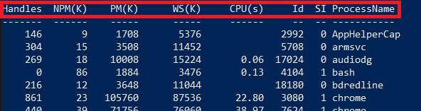

# >_ CMDLETS

PowerShell is a cross-platform task automation and configuration management framework, consisting of a command-line shell and scripting language. Unlike most shells, which accept and return text, PowerShell is built on top of the .NET Common Language Runtime (CLR), and accepts and returns .NET objects. This fundamental change brings entirely new tools and methods for automation.

## CMDLET Example
When you run the command: ```Get-Process```

You will get a object returned listing processes running on the machine. 


## Pipeline Operator 
You can take the output of a cmdlet and pipe it into another command using the pipe operator ```|```

As stated previously powershell works by accepting and returning .Net objects. A great way to illustrate that is to use the ```Get-Member``` command. The Get-Member cmdlet can be used on any powershell object and returns the properties and methods, of objects.

```Get-Process | Get-Member``` 
Output:


### Properties highlighted in Red
Properties are the data that is associated with an object. Different types of object have different properties.

```Get-Process``` Output:
 


### Methods

A "method" is a set of instructions that specify an action you can perform on the object. 


Lets explore what happens when we try to use one of these methods. 

1. Launch note pad 
2. Lets kill that proccess by using the Kill Method we identified above


As you can see this kills the notepad.exe application and it closes.


End of unit Demo:


3. [CMDLETS Continued](cmdlets2.md)