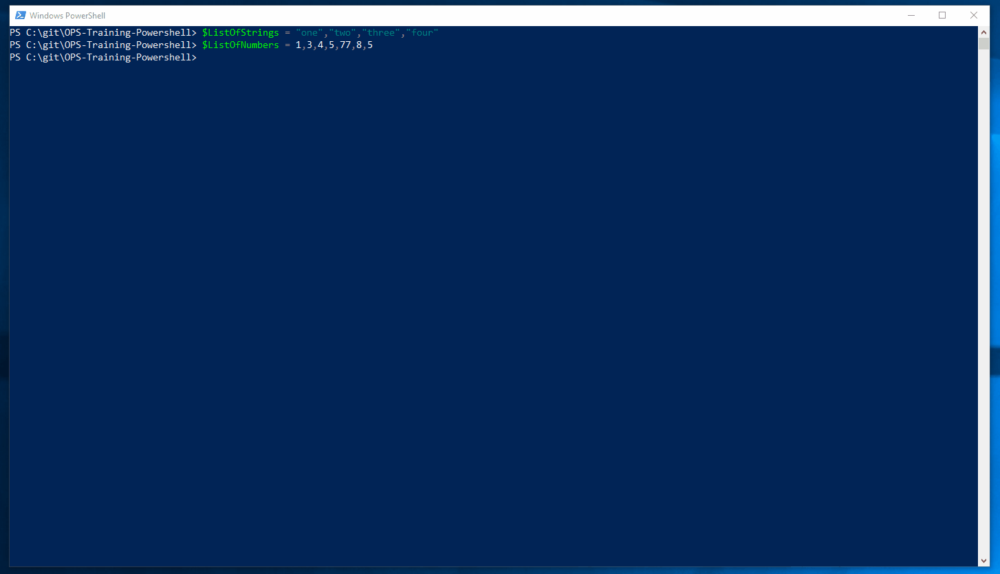

# Indexing

When you have a list of objects you can address specific items in that list by using it's index. Powershell uses zero based indexing. Zero-based array indexing is a way of numbering the items in an array such that the first item of it has an index of 0.

Lets look at an example:

```
$ListOfStrings = "one","two","three","four"

# This will display the first item in the list
$ListOfStrings[0]

# This will display the second item in the list 
$ListOfStrings[1]

# Now lets display the last item in the list 
$ListOfStrings[-1]

# Now lets compare the items in the list 

$ListOfStrings[1] -eq "two"

```

Lets look at another example

```
$ListOfNumbers = 1,3,4,5,77,8,5

# We can use the index to find specific numbers in the list exactly as before
# Using -1 will give us the last value in the list '5' 
$ListOfNumbers[-1] 

```
End of Unit Demo:


8. [Basic loops](loops.md)

