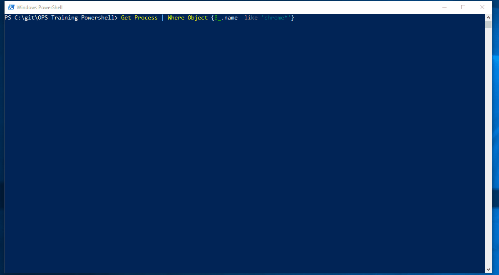

# Applying Logic To Commands

Lets look at how we can add some logic to our commands using the following ```Where``` $ ```Sort``` 

We know that ```Get-Process``` produces a list of objects with properties and methods. We can pipe ```Get-Process``` to the ```Where-Object```  command to filter the objects by a property.

Example:
```Get-Process | Where-Object {$_.name -eq 'Notepad'}
Get-Process | Where-Object {$_.name -like 'chrome*'}
```

We use a comparison operator such as ```-eq```, ```-like``` to compare the ```$_.propertyvalue``` with a value we want to filter by. 

The ```Sort-Object``` command can be used to sort objects via their property fields.

Example:
```Get-Process | Sort-Object -Descending
Get-Process | Sort-Object CPU
``` 

End of unit demo:


5. [Variables](variables.md)

