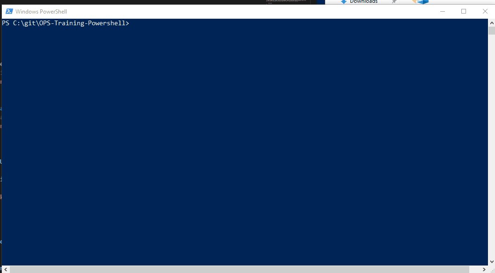
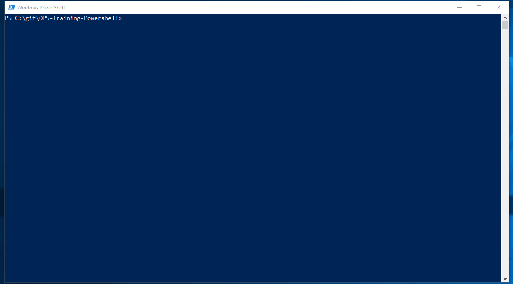
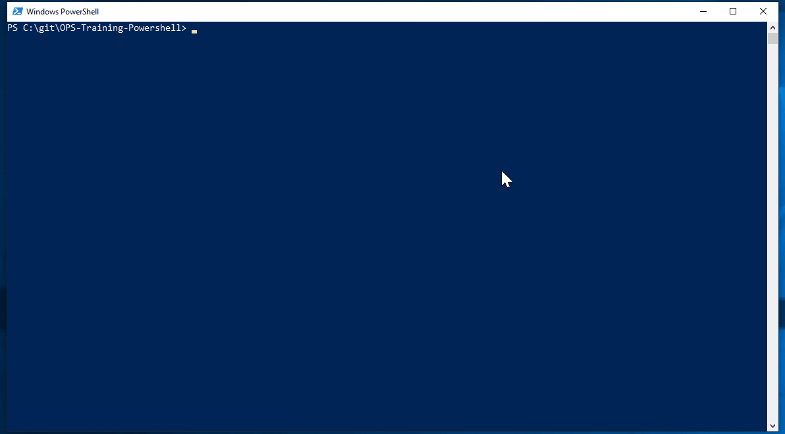

# Loops & Iterations 

Ok often within programming when you have a list of objets you want to iterate over them and do something. 

## Foreach 
Foreach allows you to Loop through a set of input objects and perform an operation (execute a block of statements) against each.

Lets take at a basic example using our previous list. We will loop through each item in our list and evaluate weather or not it is a odd or even number. 

```
$ListOfNumbers = 1,3,4,5,77,8,5

Foreach($item in $ListOfNumbers)
{
    $item % 2
}
```
This will return a list of numbers 1 & 0. The numbers that are 1 represent a odd number in the corresponding list and 0 the even numbers. Now while this is useful it's not very clear. Lets expand on this by using the IF condition and some of the other things we have already seen. 


## Conditions (if)
You can use the If statement to run code blocks if a specified conditional test evaluates to true. lets look at an example:
```
$number = Get-Random -Minimum 0 -Maximum 1000
Write-output "The number is $number"

if ($number -lt 100)
    {write-host "$number is less than 100"}
elseif ($number -lt 500)
    {write-host "$number is less than 500"}
else
    {write-host "$number is greater than or equal to 500"}
```


In powershell 0 -eq to $true and 1 -eq $false so if we know our output gives a 0 for even and 1 for odd we can use a if command to run additional code blocks 

```
$ListOfNumbers = 1,3,4,5,77,8,5

Foreach($item in $ListOfNumbers)
{
    if($item % 2)
    {
        Write-Host "$item is odd"
    }
    else{Write-Host "$item is even"}
}
```


