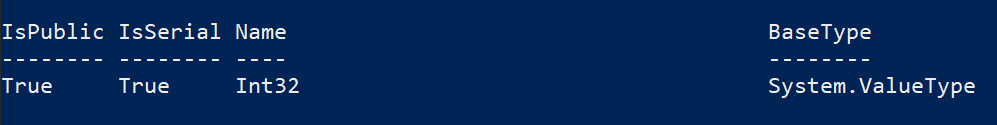
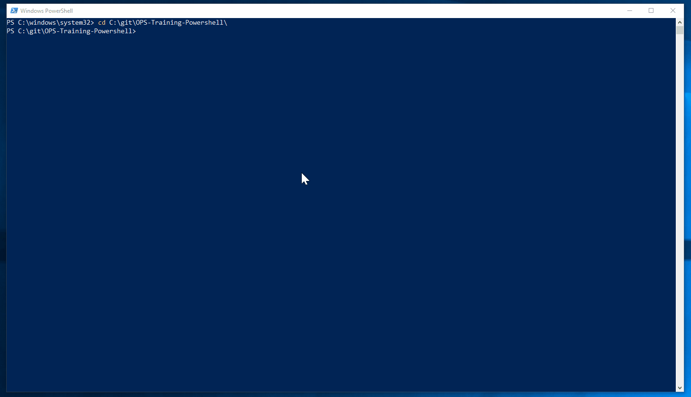

# Variables

You can store all types of values in PowerShell variables. For example, you can store the results of commands, and store elements that are used in commands and expressions, such as names, paths, settings, and values.

Lets start by storing a int (integer) value in a variable: 
```
$MyVariable = 1
```
How do we know what type of value is stored in a variable? ie string, int, double. In the example above it's obvious as we have assigned a numeric value of ```1```. However lets assume for the moment we don't know if this value is a string representation of 1 or a integer. We can inspect the objects by using the method GetType() 
```
$MyVariable.GetType()
```


We can add integers together 

```
# Int Example
$one = 1
$two = 2
$three = $one + $two

Write-Output "$three"
```

Now lets concatenate some strings (concatenation is the operation of joining character strings end-to-end)

```
$H = "Hello"
$W = " World"
$HW = $H + $W
Write-Output $HW
```


PowerShell has many methods for strings lets explore a few.

```
($HW | Get-Member).where({$_.MemberType -eq 'Method'})
```

From the output lets use the ToUpper() method. This method makes all characters capitals. 
```
$HW.ToUpper()
$HW.ToLower()
```

End of Unit Demo:


6. [Comparison](comparisons.md)